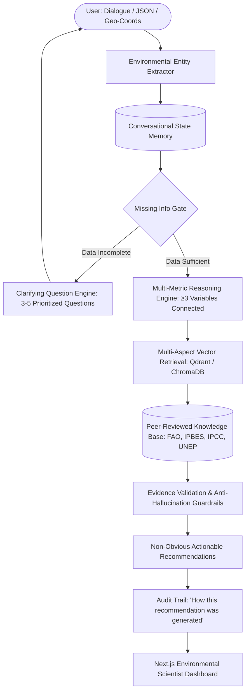

# Darukaa.Earth — AI Biodiversity Intelligence System

> **"From environmental data to evidence-backed biodiversity action."**

Built for the **Darukaa.Earth AI Biodiversity Intelligence Challenge**.

Darukaa.Earth is an **AI Environmental Scientist** that diagnoses ecological degradation and formulates actionable, evidence-backed biodiversity interventions. Unlike naive chatbots that pass raw user prompts directly to an LLM, Darukaa.Earth implements an enterprise-grade pipeline combining **structured environmental state extraction**, **multi-metric causal reasoning (connecting $\ge 3$ variables)**, **multi-aspect RAG retrieval from peer-reviewed scientific literature**, and **strict evidence validation**.

---

## 1. Architectural Pipeline



---

## 2. Core Capabilities

1. **Structured Environmental State Model**: Tracks 6 dedicated sub-profiles across Soil Health (pH, SOC %, moisture %), Climate Stress (rainfall, temperature, drought risk), Land Cover (crop, monoculture vs. rotation, canopy), Biodiversity indicators, Human Pressure (pesticides, fertilizers), and Location.
2. **Missing Information Detection & Clarification**: Instead of providing generic advice, the system identifies diagnostic gaps and generates 3–5 prioritized inquiries ($\text{Required} \rightarrow \text{Highly Useful} \rightarrow \text{Optional}$).
3. **Multi-Turn Conversational Memory**: Incremental state persistence across turns without re-asking established variables.
4. **Multi-Metric Reasoning ($\ge 3$ Variables)**: Connects compounding factors (e.g. Low Rainfall $<500\text{mm}$ + Soil Carbon $<0.6\%$ + Cereal Monoculture $\rightarrow$ Soil Pore Collapse $\rightarrow$ Microbial Functional Starvation).
5. **Multi-Aspect Semantic RAG**: Generates multi-variable search vectors and queries dual vector storage (Qdrant with automatic ChromaDB fallback) using reciprocal rank fusion.
6. **Peer-Reviewed Scientific Grounding**: Zero fabricated citations. Backed by authentic publications from the **FAO**, **IPBES**, **IPCC**, **UNEP**, and *Science* / *Nature*.
7. **Strict Evidence Validation & Refusal of Fake Precision**: Rejects unsupported numerical claims (e.g. Scenario 3: *"How much will biodiversity increase if I plant 100 trees?"* $\rightarrow$ refuses arbitrary percentages and details biological determinants).
8. **RAG Transparency Audit ("How this was generated")**: Full step-by-step trace showing inputs, variables considered, causal loops, documents retrieved, and validated evidence.

---

## 3. Technology Stack

* **Frontend**: Next.js 14, React 18, TypeScript, Tailwind CSS, Lucide Icons.
* **Backend**: Python 3.11+, FastAPI, Uvicorn, Pydantic v2, SQLAlchemy.
* **Vector Database**: Qdrant (production) with automatic ChromaDB / local in-memory fallback.
* **Relational Database**: SQLite (default local) / PostgreSQL (via Docker Compose).
* **LLM Layer**: Modular abstraction layer supporting OpenAI, Google Gemini, and a deterministic scientific engine fallback.

---

## 4. API Endpoints

| Method | Endpoint | Description |
| :--- | :--- | :--- |
| `POST` | `/api/chat` | Main conversational diagnostic endpoint with state accumulation & clarification. |
| `POST` | `/api/environment/analyze` | Direct structured JSON environmental telemetry ingestion endpoint. |
| `POST` | `/api/environment/validate` | Independent evidence verification endpoint for proposed interventions. |
| `POST` | `/api/knowledge/search` | Semantic vector search endpoint across indexed scientific documents. |
| `POST` | `/api/knowledge/ingest` | Document ingestion pipeline trigger (JSON, TXT, MD, CSV). |
| `GET` | `/api/sources` | Lists all authentic peer-reviewed sources with metadata and URLs. |
| `GET` | `/api/health` | Health check and vector backend telemetry. |
| `GET` | `/api/evaluation` | Developer & Hackathon evaluation dashboard telemetry. |

---

## 5. Preloaded Demo Scenarios

### Scenario 1: Semi-Arid Farmland (Direct JSON Analysis)
**Input (`POST /api/environment/analyze`):**
```json
{
  "soil_ph": 7.8,
  "organic_carbon": 0.3,
  "moisture": 15,
  "rainfall": 450,
  "crop": "wheat",
  "land_use": "monoculture",
  "region": "semi-arid"
}
```
**Outcome:** Identifies the Dryland Monoculture Carbon-Moisture Deficit ($SOC < 0.5\%$, Rainfall $<500\text{mm}$, Monoculture). Retrieves FAO and IPCC studies. Generates non-obvious recommendations:
1. *Introduce drought-tolerant legume intercropping (Cicer arietinum / chickpea) in 4:2 rows.*
2. *Establish native perennial flowering buffer strips (5-10m) along field perimeters.*
3. *Implement organic surface mulching to suppress thermal stress and reduce evaporative loss.*

### Scenario 2: Multi-Turn Conversation
* **Turn 1 (User)**: *"Biodiversity is declining on my farm."*  
  **AI**: Detects missing diagnostic signals, sets `status = "needs_information"`, and prompts for SOC %, rainfall, and crop type.
* **Turn 2 (User)**: *"Carbon is 0.3%, rainfall is low and I grow wheat."*  
  **AI**: Stores $SOC = 0.3\%$ and $Crop = wheat$, and asks for the specific rainfall amount.
* **Turn 3 (User)**: *"Around 450 mm."*  
  **AI**: Synthesizes all 3 turns ($SOC = 0.3\%$, $Rainfall = 450\text{mm}$, $Crop = wheat$), activates the multi-metric reasoning engine, and delivers the full diagnostic without re-asking.

### Scenario 3: Refusal of Fake Precision (Anti-Hallucination)
* **Query**: *"How much will biodiversity increase if I plant 100 trees?"*
* **Response**: Rejects speculative percentage predictions. Cites Holl & Brancalion (*Science* 2020) explaining why arbitrary seedling counts cannot linearly predict biodiversity without site-specific biome suitability, hydrologic balance, and native species selection.

---

## 6. Quick Start & Setup Instructions

### Prerequisites
* Python 3.10+
* Node.js 18+ and npm

### 1. Clone & Configure Environment
```bash
cp .env.example .env
```

### 2. Run Backend
```bash
# Install Python dependencies
pip install -r backend/requirements.txt

# Ingest scientific documents and seed database
python scripts/ingest_documents.py
python scripts/seed_database.py

# Run FastAPI backend server
uvicorn backend.app.main:app --host 0.0.0.0 --port 8000 --reload
```
API Documentation will be live at: `http://localhost:8000/docs`

### 3. Run Frontend
```bash
cd frontend
npm install
npm run dev
```
Dashboard will be accessible at: `http://localhost:3000`

---

## 7. Running with Docker Compose

To launch the full production environment with **Frontend**, **Backend**, **Qdrant Vector DB**, and **PostgreSQL**:
```bash
docker-compose up --build
```

---

## 8. Running Automated Test Suite

Darukaa.Earth includes comprehensive automated tests covering every layer of the system:
```bash
python -m pytest backend/tests -v
```

**Test Coverage:**
* `test_extraction.py`: Quantitative entity extraction from natural language.
* `test_clarification.py`: Missing information detection and question prioritization.
* `test_memory.py`: Multi-turn state persistence and incremental profile updates.
* `test_reasoning.py`: Multi-metric causal reasoning connecting $\ge 3$ variables.
* `test_rag.py`: Subquery generation and multi-dimensional vector search.
* `test_validation.py`: Evidence validation and fake precision rejection.
* `test_end_to_end.py`: End-to-end integration across Scenarios 1, 2, and 3.

---

## 9. Evaluation Dashboard

Navigate to the **Evaluation Dashboard** tab in the web UI (or `GET /api/evaluation`) to view real-time pipeline telemetry:
* **RAG Retrieval Quality**: Precision estimates, indexed chunk count, and reciprocal rank fusion status.
* **Reasoning Integrity**: Active feedback loops and minimum variable threshold verification ($\ge 3$).
* **Evidence Validation**: 0% unsupported claims accepted, active anti-hallucination guardrails.
* **Conversational Memory**: Active dialogue turns and cross-turn persistence verification.
