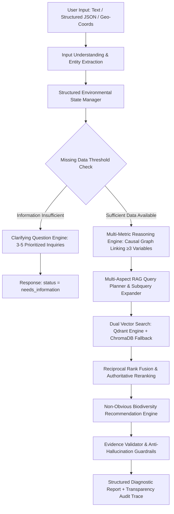

# Darukaa.Earth — System Architecture & Scientific Methodology

## 1. Architectural Overview

Darukaa.Earth is an **AI Environmental Scientist** designed from first principles to overcome the fundamental flaws of naive LLM-based agricultural chatbots. Generic LLMs hallucinate recommendations, overlook compound environmental constraints, and produce vague advice ("practice sustainable farming").

Darukaa.Earth enforces an end-to-end multi-layer architecture where every intervention is derived through **structured environmental state accumulation**, **multi-metric causal reasoning (linking $\ge 3$ variables)**, **semantic RAG retrieval from peer-reviewed scientific literature**, and **strict evidence validation**.

---

## 2. Deep Dive into Architectural Layers

### Layer 1: Input & Ingestion Layer
* **Purpose**: Accepts multi-modal environmental telemetry including natural language dialogue, structured JSON (`POST /api/environment/analyze`), and geographical coordinates (Bonus: latitude/longitude lookup).
* **Rationale**: Real-world environmental managers, agronomists, and farmers communicate through different mediums—ranging from field observations ("my soil is dry and yields are dropping") to digital soil health card JSON payloads.

### Layer 2: Environmental Entity Extractor
* **Purpose**: Parses unstructured text into quantitative metrics across 6 distinct sub-profiles:
  1. `SoilProfile`: pH, organic carbon %, volumetric moisture %, microbial activity, erosion risk.
  2. `ClimateProfile`: annual rainfall (mm), surface temperature (°C), drought risk index.
  3. `LandProfile`: primary crop, cropping system (monoculture, rotation, agroforestry), canopy cover.
  4. `BiodiversityProfile`: species richness, habitat diversity, pollinator abundance.
  5. `HumanImpactProfile`: pesticide pressure, fertilizer intensity, deforestation.
  6. `LocationProfile`: country, region, coordinates.
* **Rationale**: LLMs lose numerical precision when reasoning over unstructured conversation transcripts. By extracting structured numerical state immediately, downstream reasoning operates on verified facts.

### Layer 3: Conversational Memory & State Manager
* **Purpose**: Maintains an incremental, persistent relational profile across dialogue turns using SQLite/PostgreSQL.
* **Rationale**: Environmental assessment is inherently iterative. When a user provides their crop in Turn 1, rainfall in Turn 2, and soil carbon in Turn 3, the state manager retains all previous variables without re-asking questions.

### Layer 4: Clarifying Question Engine
* **Purpose**: Detects missing diagnostic variables and dynamically prioritizes questions:
  $$\text{Required} \rightarrow \text{Highly Useful} \rightarrow \text{Optional}$$
  Strictly caps inquiries at 3–5 items per turn.
* **Rationale**: Naive bots either dump dozens of questions or jump to premature conclusions. This engine calculates diagnostic information value and asks only what is scientifically necessary to unlock causal reasoning.

### Layer 5: Multi-Metric Reasoning Engine
* **Purpose**: Models non-linear, multi-variable causal interactions. **Strictly mandates connecting at least three environmental variables** before generating high-confidence diagnoses.
* **Modeled Feedback Loops**:
  * **Dryland Monoculture Carbon-Moisture Deficit**:
    $$\text{Annual Rainfall } (<500\text{ mm}) + \text{Soil Carbon } (<0.6\%) + \text{Continuous Monoculture} \implies \text{Pore Collapse} \implies \text{Severe Microbial Starvation}$$
  * **Alkaline-Thermal Carbon Oxidation Dynamic**:
    $$\text{Alkaline pH } (>7.5) + \text{Thermal Stress } (>30^\circ\text{C}) + \text{Low SOC} \implies \text{Phosphorus Lockup} + \text{Rapid Carbon Volatilization}$$
  * **Trophic Pollinator Depletion**:
    $$\text{Monoculture} + \text{Intensive Pesticide} + \text{Field Boundary Removal} \implies 40\text{--}70\% \text{ Decline in Wild Pollinator Abundance}$$

### Layer 6: RAG Query Planner & Dual Vector Database
* **Purpose**: Deconstructs environmental questions into paired search vectors (e.g. `drought + biodiversity`, `soil organic carbon + microbial diversity`, `legume intercropping + Rhizobium`). Queries Qdrant or persistent ChromaDB with reciprocal rank fusion (RRF) and authoritative organizational weighting (FAO, IPBES, IPCC, UNEP, Nature, Science).
* **Rationale**: Keyword matching misses ecological synonyms. Multi-query semantic expansion ensures evidence retrieval spans both abiotic drivers and biotic responses.

### Layer 7: Recommendation Engine
* **Purpose**: Formulates specific, actionable, and non-obvious biodiversity interventions (e.g., native flowering buffer strips, drought-tolerant legume intercropping, in-situ contour swales).
* **Requirements**: Every recommendation contains:
  1. Concrete action statement.
  2. Scientific mechanism ("Why it works").
  3. Impacted metrics with direction ($\uparrow$ or $\downarrow$) and time horizon (short, medium, long term).
  4. Real citations with authentic URLs.

### Layer 8: Evidence Validation & Anti-Hallucination Guardrail
* **Purpose**: Cross-references every recommendation and metric claim against retrieved document text.
* **Key Guardrail (Scenario 3)**:
  Rejects speculative quantitative claims (e.g. *"How much will biodiversity increase if I plant 100 trees?"*). Citing Holl & Brancalion (*Science* 2020), it explains why linear percentage predictions are ecologically invalid without baseline biome suitability, landscape connectivity, and hydrologic metrics.

### Layer 9: Transparency Audit Trail Generator
* **Purpose**: Generates a complete audit trace of:
  $$\text{Inputs} \rightarrow \text{Variables Considered} \rightarrow \text{Identified Causal Loops} \rightarrow \text{Retrieved Docs} \rightarrow \text{Validated Evidence}$$
  Accessible via the **"How this recommendation was generated"** button.

---

## 3. Technology Stack Rationale

| Component | Technology | Rationale |
| :--- | :--- | :--- |
| **Backend** | Python / FastAPI | Native asynchronous performance, typed Pydantic schemas, rich scientific and ML ecosystem. |
| **Frontend** | Next.js / React / Tailwind | Clean, accessible environmental scientist dashboard; server-side rendering and typed APIs. |
| **Vector DB** | Qdrant + ChromaDB | High-performance HNSW vector indexing with seamless in-memory/embedded local fallback for zero-friction setup. |
| **Relational DB** | SQLite / PostgreSQL | ACID transactions for multi-turn conversational session states and source metadata. |
| **LLM Layer** | Modular Provider Abstraction | Pluggable architecture supporting OpenAI, Gemini, or a deterministic scientific synthesis engine. |
